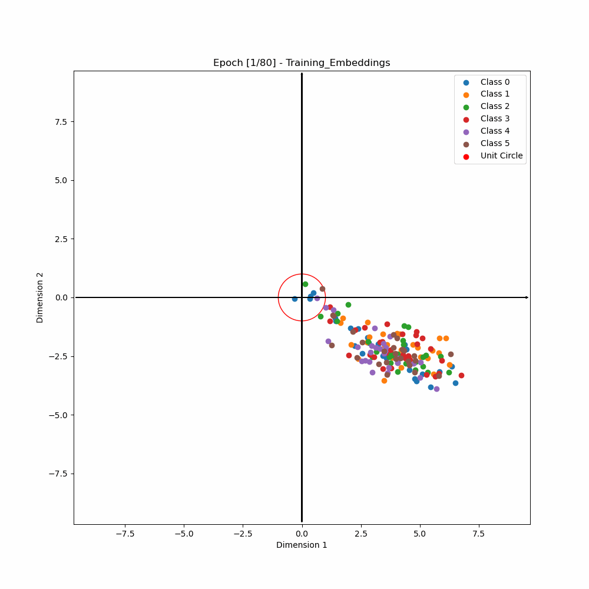

# 2D ArcFace Embeddings Visualization

This repository contains code for code for creating 2D ArcFace embeddings and visualizing their separation during training. The goal is to demonstrate how different classes get separated from each other through the course of training using the ArcFace loss.

<p align="center">
   <figure>
   
   <figcaption>Fig.1 - A GIF demonstrating how 2d embeddings evolve during training.</figcaption>
   </figure>
</p>

This is a companion repo to my blog about ArcFace Loss and it's use in training Face recognition models.

## Usage

To use this code to produce and visualize embeddings:

1. Clone the repository.
```
git clone https://github.com/jayeshmahapatra/ArcFace-Embedding-Visualization.git
```

2. Install the required dependencies.
```
pip install -r requirements.txt
```

3. Download the `Align&Cropped CelebA dataset` from this [link](https://mmlab.ie.cuhk.edu.hk/projects/CelebA.html) and extract it inside the [data](./data/) folder.

```
data/img_align/celeba
```

4. Download the annotations `Identities Annotations` from the same link and place it inside [data](./data/) folder as `identity_CelebA.txt`

```
data/identity_CelebA.txt
```

5. Run the training script which will finetune a frozen Resnet18 model on a small subset of `CelebA` and generate embedding visualizations. This will be stored inside the data folder at

```
data/Training_Embeddings.gif
```

## Contributing

Contributions to this repository are welcome! If you find any issues or have suggestions for improvements, please create a new issue or submit a pull request.

## License

This project is licensed under the [MIT License](LICENSE).

